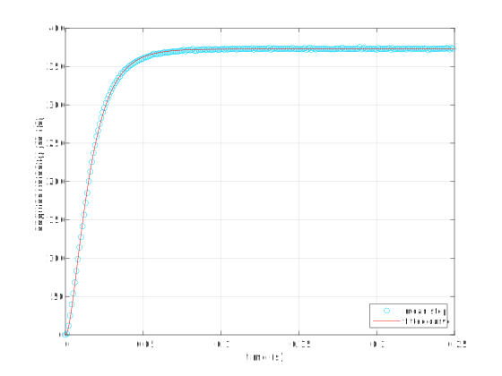
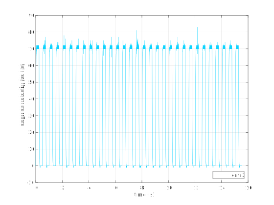

# Motor parameter estimation for the Phidgets DCM4000_0/Dhongzheng 63ZY125-2430 DC motor

The purpose of the experiment that this directory analyzes is to measure the parameters of the Phidgets DCM4000_0/Dhongzheng 63ZY125-2430 DC motor. The main results are the following parameters in SI units (MKS):

```
R = 1.0916	
wn = 129.39	
z = 1.1077	
b = 3.9919e-05	
Km = 0.063693	
J = 6.4178e-05	
L = 0.0038161	
```
The results were obtained by a measurement of the step response at 24 V. The response was measured 31 times and the mean was fit to a second-order motor model (see `phidgets_motor_estimation.m`). The mean step response and the fit are shown in the following figure.



Some details of the experiment follow.

## Setup

The motor had no load attached, so all inertia was due to the rotor and shaft. The HKT22 optical encoder with 300 CPR was used to take the measurement. The myRIO C connector Encoder 0 input received the encoder signal. A sample rate of 1 ms was deemed sufficient after several iterations. Thirty-one consecutive 24 V steps were applied with the Pololu 18v17 motor driver. Each step response was followed by a free response of the same length of time, together comprising 501 samples. The velocity was stored in `phidgets_motor_estimation_r1.mat` in BDI/BTI. The controlling C program is in the `T1D1-workspace-solutions` repository directory [phidgets-motor-encoder-estimation](https://github.com/rtc-book/T1D1-workspace-solutions/tree/main/phidgets-motor-encoder-estimation).

## Results

The raw data captures are shown below.



The spikes here are a little foreboding about the quality of the encoder, but they averaged out ok. In other runs, higher spikes were observed.

The graph of the step response mean and its fit are repeated below. The fit is excellent. Nonlinear least squares were used. Although we could estimate `Km` and `b` from the motor curves, in the end we got a better fit from letting both parameters vary. If both are taken from the motor curves, the steady-state value was off. If `Km` was taken from the motor curves, our estimate of `b` seemed unrealistic. If `b` was taken from the motor curves, our estimate of `Km` was fine, but the fit was slightly worse.


## Further work

The free responses were also captured, but unused in the parameter estimation. It may be that we could have higher confidence in our estimates of `Km` and `b` if we used these responses.