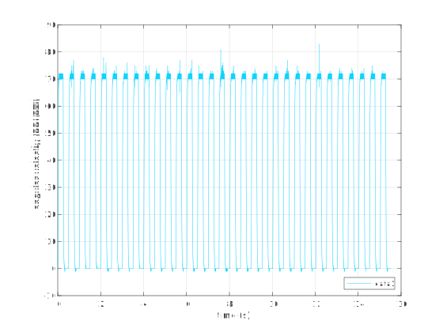

# Linearity tests for the Pololu 18v17 motor driver

The purpose of the experiment that this directory analyzes is to measure the linearity of the Pololu 18v17 motor driver. The main result is that the driver is quite linear, as shown in the following plot.

Some details of the experiment follow.

## Setup

Below is the test setup for test **r2**.

The resistors $R_1$ and $R_3$ are power resistors that together comprise the load, measured to be $11.48$ Ω. The 10 mF capacitor smooths the PWM. The reason the load is split is to allow the smoothing to occur (otherwise the cap is a dependent energy storage element) and to divide down the voltage somewhat for the measurement. To use the myRIO A Connector for the AI measurement, the signal must be divided again, as shown. 

We had intended to do several runs, but the difficulty in setup and time constraints were prohibitive. In the end, we only completed **r1** and **r2**, which both had the same load resistance. Run **r2** was for negative voltages, which had to be separated from the positive voltages due to the 0-5 V voltage range of the AI, the voltage divider, and the polar capacitor. Run **r1** was for positive voltages. The setup differed slightly from the figure above: it is important to have the capacitor voltage drop in the proper direction and for the voltage divider to have its low side at ground. Due to the high power, soldering and resoldering were required for the load on each setup. The voltage divider was on a breadboard. All resistor values are defined in `test_amplifier_pololu18v17_linearity.m`. Below is a photo of the **r2** load setup.

The code that controls the experiment is in the `T1D1-workspace-solutions` repository in the directory [`pololu-18v17-amplifier-linearity-test`](https://github.com/rtc-book/T1D1-workspace-solutions/tree/main/pololu-18v17-amplifier-linearity-test).

## Results

The raw data captures are shown below, scaled by the voltage divider gains.

The sample rate was 10 ms. Each voltage level consists of 20 points, and there are 101 levels. Both runs appear positive because the power had to be reversed to measure the negative side (so the measurement was positive, even though the driver was applying a negative voltage). 

The first level is at a PWM with zero duty cycle (note the lack of high-frequency components). A multimeter measurement showed this voltage to be actually 0.5 mV, so we determined that the zero-duty-cycle measurements were a bias in all voltage measurements and subtracted the mean value of the first level from all data. We also added 0.5 mV, the "actual" offset, to all the data.

The main result is shown below (the same as the first figure on this page). The means of the 20 samples at each voltage level are plotted. The "perfectly linear and nominal" line is shown in black.

We see a very linear relationship. There is a small deviation from linearity at low voltage. There is also a small slope difference from nominal. This could be explained by errors in divider resistor measurements and unaccounted-for resistances of wires and solder joints (we are dealing with small resistances, after all). 

Below is the current inferred from the voltage measurement and (statically) measured resistances.

This is not much more informative than the previous plot, but does show that for a current draw up to 2 A, we can have confidence in the linearity of the driver.