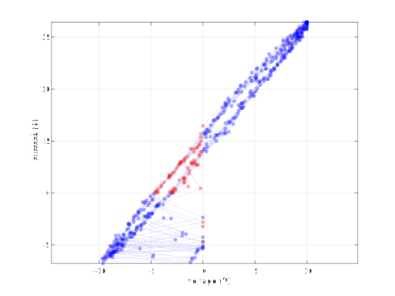
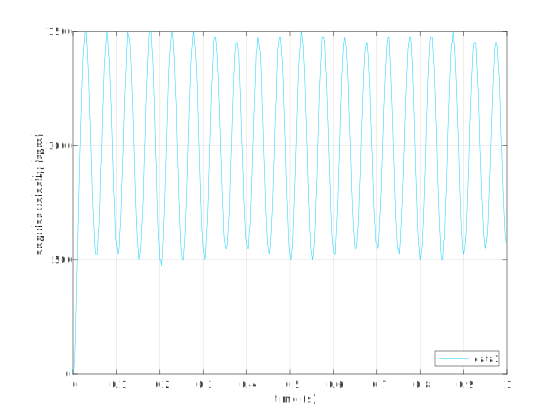
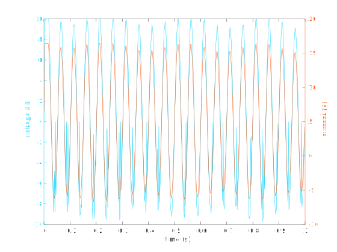
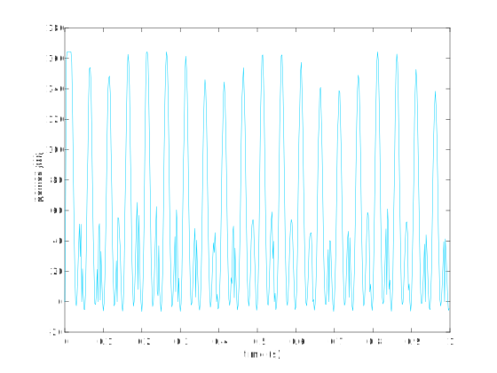

# Pololu 18v17 motor driver four-quadrant demonstration

The purpose of the experiment that this directory analyzes is to demonstrate the four-quadrant ability of the Pololu 18v17 motor driver when paired with the Pololu shunt regulator (fine-adjust HV, 4.10Ω, 15W). The primary result is the following plot of applied current vs voltage for an extremely underdamped velocity control response.

This shows that the amplifier functions in the second quadrant and a few points were captured in the fourth quadrant. These correspond to negative power flow for the source, which is protected by the shunt regulator.

Some details of the experiment follow.

## Setup

The Phidgets DCM4000_0/Dhongzheng 63ZY125-2430 DC motor and HKT22 encoder were used. The motor had no load attached. The HKT22 optical encoder with 300 CPR was used to take the shaft position measurement from which the angular velocity was inferred. The myRIO C connector Encoder 0 input received the encoder signal. A sample rate of 2 ms was deemed sufficient. The shunt resistor for measuring the current was comprised of two parallel 3 Ω power resistors (100 W) for a total added resistance of about 1.5 Ω. The data was stored in `r1.mat`. The controlling C program is in the `T1D1-workspace-solutions` repository directory [pololu-18v17-amplifier-4-quadrant-test](https://github.com/rtc-book/T1D1-workspace-solutions/tree/main/pololu-18v17-amplifier-4-quadrant-test).

The `pololu_4_quad_demonstration.m` file processes and plots the data.

## Results

The raw data captures oscillate for five seconds. There is too much data to display helpfully here (edit `pololu_4_quad_demonstration.m` to show more points, if desired). The plot below shows the angular velocity after the commanded 1000 rpm step.

We see that the response is extremely underdamped, which was our intention in order to capture many data points in the second quadrant.

The plot below shows the applied voltage from the Pololu driver and the corresponding current measurements (from the shunt resistor). It is difficult to determine from this plot the second- and fourth-quadrant values.

The plot below is the instantaneous power flow through time. We see that the power is negative during each cycle.

It is much easier to see this on the following plot (the same as the first plot) of applied current versus applied voltage.

Here we see in red the second- and fourth-quadrant values.
